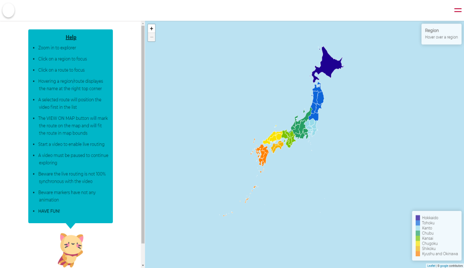

# 📄 Table of Contents

- [Introduction](#introduction)
- [Set up](#setup)
- [Ambition](#ambition)
- [Design](#design)
- [License](#license)

 
 
 

  

<h1 align="center">
  <a href="https://gatsby-leaflet.netlify.app/">Yplore</a>
</h1>

An interactive Leaflet-Map with visualized KML-Data built with Gatsby - Redux - Styled Components - GraphQl - D3 and hosted with <a href="https://www.netlify.com/" target="_blank" rel="noopener noreferrer">Netlify</a>

  

 

## 
 🛠 Set Up 

1. Install Gatsby ^2.24.54
2. Install Leaflet ^1.7.1
3. Install React-Redux ^7.2.1
4. Install Redux ^4.0.5
5. Install Redux-Logger ^3.0.6
6. Install Redux-Thunk ^2.3.0
7. Install React-ID-Generator ^3.0.1
8. Install React-Leaflet ^2.7.0
9. Install Styled-Components ^5.2.0
10. Install D3 ^6.2.0
11. Install Leaflet-kml ^1.0.1

 

## 
 🔥 Ambition 

"Practice makes perfect. After a long time of practicing, our work will become natrual, skillfull, swift, and steady. - Bruce Lee"

 

This Project was about learning some new libraries to expand my knowledge in the Front-End world. So I started to learn gatsby and d3. To make things interesting I did visualize KML-Data of a <a href="https://www.youtube.com/user/Rambalac" target="_blank" rel="noopener noreferrer">youtuber(Rambalac)</a>. The idea came to me while I was watching his videos. I kinda missed the live tracking of his walking route, after a little research I didn't find a website, so created this projects for myself.

 
  
 
## 
 🔱 Design 

 The Design is about understanding the fundamentals and appling them. In the process of creating the project, i created a japanese themed website. The colours are picked in awareness of the culture and regions to build a warm and asian like reputation of Yplore. A fluid UI rounds everything up.

| Color  | Hex                                                                |
| ------ | ------------------------------------------------------------------ |
| Blue   |  `#bbe2f2` |
| Red    |  `#bf0436` |
| Yellow |  `#F6B73E` |
| Grey   |  `#555555` |
| Grey-2 |  `#d9d9d9` |
| Grey-3 |  `#777777` |

| Prefecture Color   | Hex                                                                |
| ------------------ | ------------------------------------------------------------------ |
| Hokkaido           |  `#1E0091` |
| Tohoku             |  `#0D65D9` |
| Kanto              |  `#97DAE8` |
| Chubu              |  `#259E63` |
| Kansai             |  `#7AC200` |
| Chugoku            |  `#FAE200` |
| Shikoku            |  `#F2B407` |
| Kyushu and Okinawa |  `#FF8000` |

## 
 ⚖️ License 

Copyright (c) [2020] [Berkay Yurdagül]

Permission is hereby granted, free of charge, to any person obtaining a copy of this software and associated documentation files (the "Software"), to deal in the Software without restriction, including without limitation the rights to use, copy, modify, merge, publish, distribute, sublicense, and/or sell copies of the Software, and to permit persons to whom the Software is furnished to do so, subject to the following conditions:

The above copyright notice and this permission notice shall be included in all copies or substantial portions of the Software.

THE SOFTWARE IS PROVIDED "AS IS", WITHOUT WARRANTY OF ANY KIND, EXPRESS OR IMPLIED, INCLUDING BUT NOT LIMITED TO THE WARRANTIES OF MERCHANTABILITY, FITNESS FOR A PARTICULAR PURPOSE AND NONINFRINGEMENT. IN NO EVENT SHALL THE AUTHORS OR COPYRIGHT HOLDERS BE LIABLE FOR ANY CLAIM, DAMAGES OR OTHER LIABILITY, WHETHER IN AN ACTION OF CONTRACT, TORT OR OTHERWISE, ARISING FROM, OUT OF OR IN CONNECTION WITH THE SOFTWARE OR THE USE OR OTHER DEALINGS IN THE SOFTWARE.
